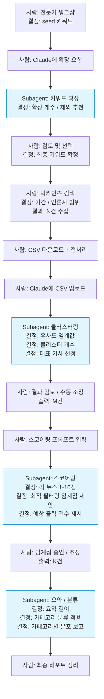
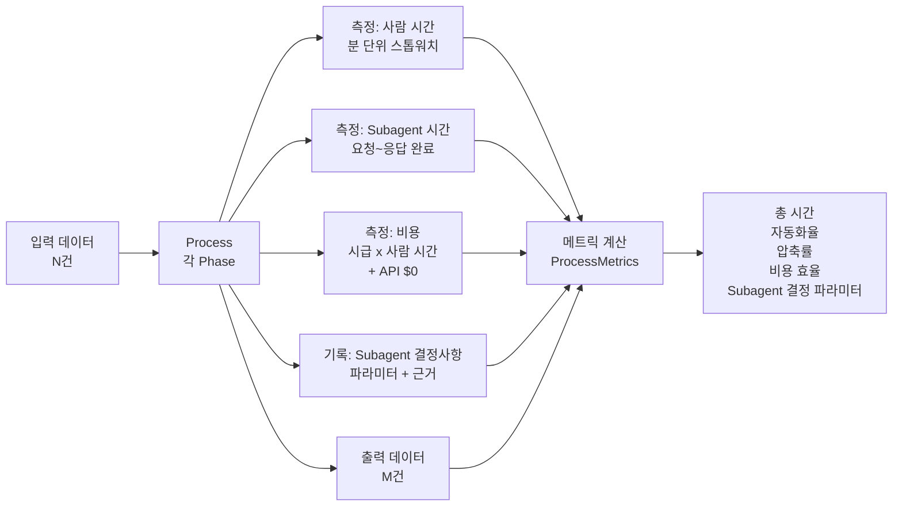
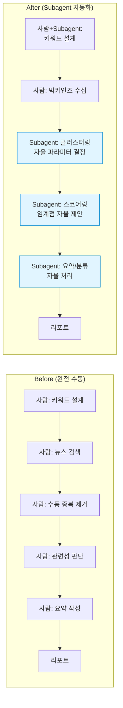
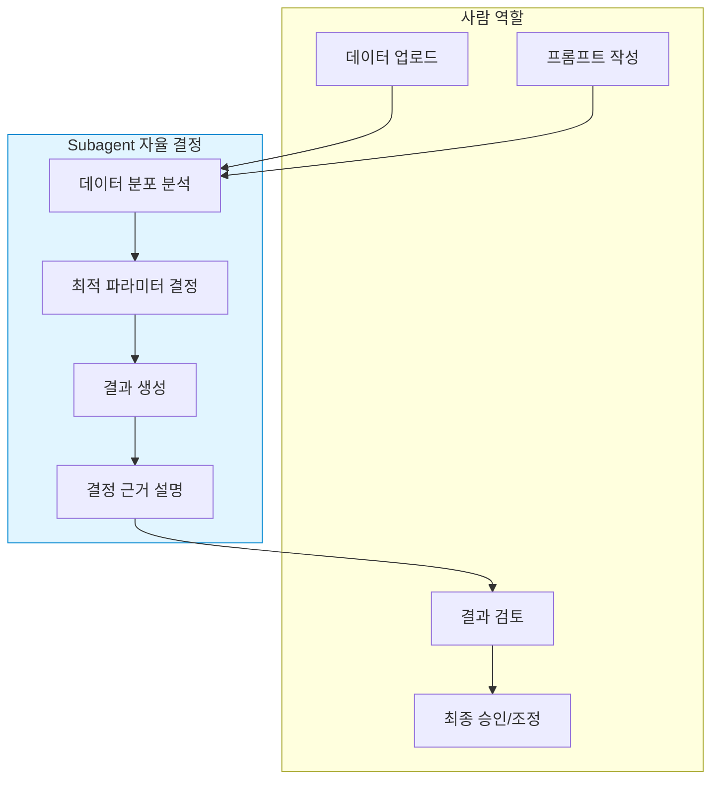

# 뉴스클리핑 자동화 시스템 - 다이어그램 & 비교표

---

## 다이어그램 1: 전체 파이프라인 (역할 + 결정 주체)

> **범례:** 파란 배경 = Subagent(Claude)가 자율 결정하는 단계

---

## 다이어그램 2: 메트릭 측정 플로우

---

## 다이어그램 3: Before vs After 프로세스

---

## 비교표 1: Phase별 메트릭 (빈 템플릿 - 측정 후 기입)

| Phase | 사람 시간(분) | Subagent 시간(분) | 총 시간(분) | 비용 (원) | 자동화율 | Input (건) | Output (건) | 압축률 | Subagent 결정사항 |
|---|---|---|---|---|---|---|---|---|---|
| 1. 검색어 설계 |  | 0 |  |  | 0% |  |  | - | - |
| 2. 데이터 수집 |  | 0 |  |  | 0% |  |  | - | - |
| 3. 클러스터링 |  |  |  |  |  |  |  |  | 유사도 임계값, 클러스터 수 |
| 4. 스코어링 |  |  |  |  |  |  |  |  | 필터링 임계점 |
| 5. 요약/분류 |  |  |  |  |  |  |  | - | 요약 길이 |
| **합계** |  |  |  |  |  | (최초) |  |  |  |

---

## 비교표 2: Before / After 전체 비교 (빈 템플릿)

| 지표 | Before (완전 수동) | After (Subagent) | 개선 |
|---|---|---|---|
| 총 처리 시간 (분) |  |  |  |
| 사람 작업 시간 (분) |  |  |  |
| 인건비 (원) |  |  |  |
| API 비용 | $0 | $0 | - |
| 총 비용 (원) |  |  |  |
| 주당 처리 횟수 |  |  |  |
| 일관성 | 사람마다 다름 | 높음 | 향상 |
| 의사결정 | 사람이 모두 결정 | Subagent 자율 | 효율 향상 |

---

## 비교표 3: 검색어 설계 방법론 비교

| 방법론 | 최적값 결정 방식 | 사람 시간 | 처리 시간 | 장점 | 단점 | 선택 |
|---|---|---|---|---|---|---|
| A. K-means | Elbow Method 자동 |  |  | 완전 자동화, 재현 가능 | 의미론적 유사도 한계 | |
| B. BERT 임베딩 | 분포 분석 자동 제안 |  |  | 높은 정밀도 | 모델 설치 부담(1GB+) | |
| C. LLM Interactive | 없음 (사람 결정) |  | 0 | 전문가 판단 최대 반영 | 재현성 낮음 | |
| D. Hybrid | 사람+Subagent |  |  | 전문가 판단 + 실검 검증 | 단계 多 | ✅ |

---

## 비교표 4: 클러스터링 방법 비교

| 방법 | 파라미터 결정 | 임계값 / 클러스터 수 | 처리 시간 | 정확도 | 선택 |
|---|---|---|---|---|---|
| 접근 1: TF-IDF + Dendrogram | Elbow + 2차 미분 자동 | 자동 결정 |  |  | |
| 접근 2: HDBSCAN | 알고리즘 완전 자동 | 자동 결정 |  |  | |
| 접근 3: Subagent | AI 맥락 판단 | AI가 결정 |  |  | ✅ |

---

## 비교표 5: Subagent 결정사항 요약 (빈 템플릿 - 실행 후 기입)

| Phase | 파라미터 | 결정 방식 | 결정값 | 이유 (Subagent 제공) |
|---|---|---|---|---|
| 3. 클러스터링 | 유사도 임계값 | 분포 분석 후 자율 결정 |  |  |
| 3. 클러스터링 | 클러스터 개수 | 자동 최적화 |  |  |
| 3. 클러스터링 | 소규모 클러스터 처리 | 자율 판단 후 제안 |  |  |
| 4. 스코어링 | 필터링 임계점 | 점수 분포 분석 |  |  |
| 4. 스코어링 | 예상 출력 건수 | 임계점 기반 계산 |  |  |
| 5. 요약/분류 | 요약 길이 | 내용 복잡도 기반 |  |  |
| 5. 요약/분류 | 카테고리별 분포 | 자동 집계 |  |  |

---

## 다이어그램 4: Subagent 자율 결정 흐름

